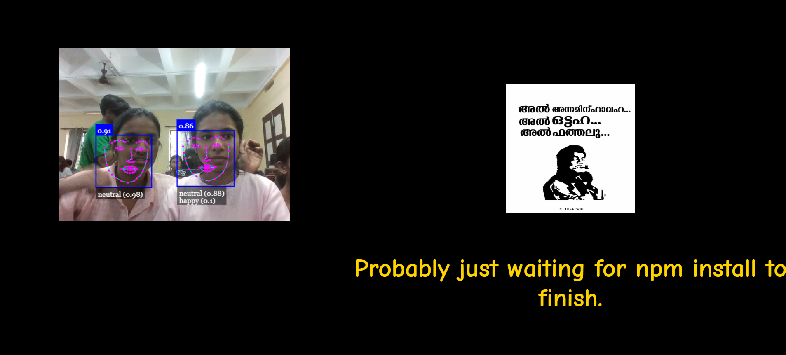
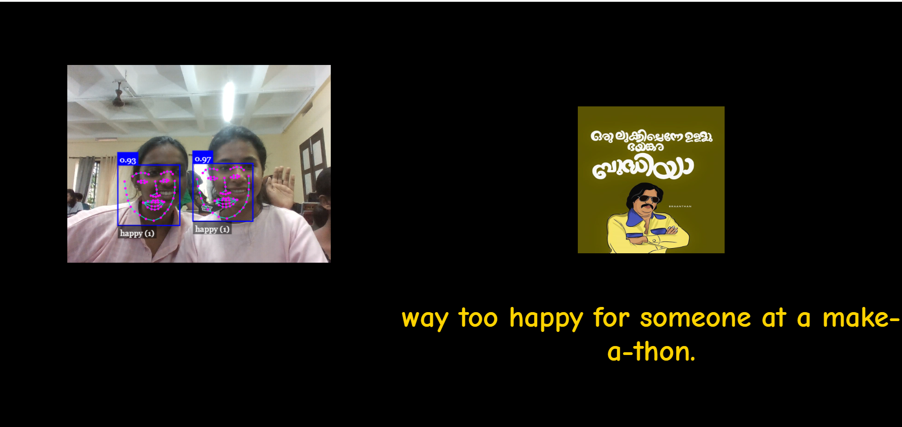
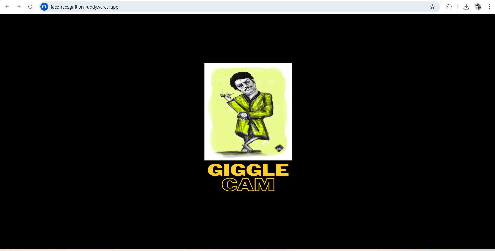

# GiggleCam 🦋😂  


---

## Basic Details
### Team Name: Zoro

### Team Members
- **Anjana M M** - Government Engineering College, Kozhikode
- **Sreeparvathi M** - Government Engineering College, Kozhikode

### Project Description
**GiggleCam** is a fun, interactive web app that uses AI-powered face detection to read your expressions in real-time and respond with hilarious captions and themed images.  
And because plain humor wasn’t enough — we added *magic*: a whimsical butterfly animation appears and disappears on mouse clicks, bringing life and chaos to the page.  
Bonus: The project starts with a splash/cover screen before the fun begins.

---

### The Problem (that doesn't exist)
People are smiling less these days… and even worse, butterflies are going extinct **on our screens**!  
Also, no one has ever complained that their webcam doesn’t make fun of them enough.

---

### The Solution (that nobody asked for)
We fixed it by combining **AI face detection**, **sassy captions**, **random funny images**, and **click-triggered butterflies** into one browser app.  
Now your screen can roast your face *and* give you virtual butterflies at the same time.

---

## Technical Details
### Technologies/Components Used
**For Software:**
- **HTML5** — Page structure
- **CSS3** — Styling, layout, splash screen animation
- **JavaScript (ES6)** — App logic
- **[face-api.js](https://github.com/justadudewhohacks/face-api.js)** — Facial recognition & emotion detection
- **Google Fonts + Custom TTF** — Comic + funky fonts
- **Canvas API** — For overlaying face detection boxes


---

### Implementation
For Software:
# Installation
https://github.com/Anjana-m-m/face-recognition.git 

# Run
 Open index.html in your browser
  or use Live Server in VS Code for smooth loading


### Project Documentation
For Software:

# Screenshots


*When you are in neutral mood*



*When you are in happy mood*



*cover page.*

### Project Demo
*try it yourself*
https://face-recognition-ruddy.vercel.app/)


## Team Contributions
- Sreeparvathi M:coding and creative image selection.
- Anjana M M: coding and text selection.
  

---
Made with ❤️ at TinkerHub Useless Projects 


```bash
# Clone the repo
(https://github.com/Anjana-m-m/face-recognition.git)


